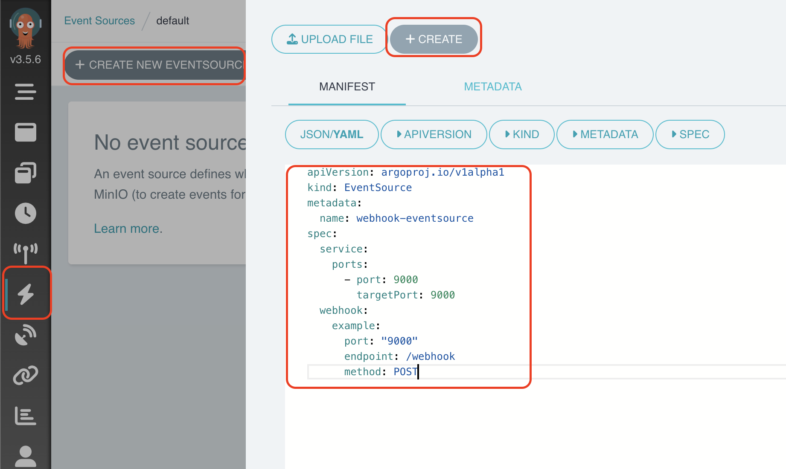

# Argo EcoSystem


This repository is dedicated to [argoproj](https://argoproj.github.io/) for learning purposes.

- [Argo EcoSystem](#argo-ecosystem)
  - [What's Argo Ecosystem?](#whats-argo-ecosystem)
  - [Argo EcoSystem Components](#argo-ecosystem-components)
  - [Detailed Comparison](#detailed-comparison)
  - [Argo Workflows](#argo-workflows)
    - [Key Features](#key-features)
    - [Use Cases](#use-cases)
    - [Additional Resources](#additional-resources)
    - [Setup](#setup)
      - [Create a forwarding port for access to Argo Workflow](#create-a-forwarding-port-for-access-to-argo-workflow)
    - [Labs: Create a Workflow](#labs-create-a-workflow)
    - [Workflows vs Workflow Templates](#workflows-vs-workflow-templates)
      - [Workflows](#workflows)
      - [WorkflowTemplates](#workflowtemplates)
      - [Differences](#differences)
    - [Labs: Create a Workflow Template with parameters](#labs-create-a-workflow-template-with-parameters)
    - [Labs: Define WorkflowTemplate with multiples steps and multiple templates](#labs-define-workflowtemplate-with-multiples-steps-and-multiple-templates)
    - [Labs: Define WorkflowTemplate with volume](#labs-define-workflowtemplate-with-volume)
    - [Labs: Create Workflow Template with Daemon step](#labs-create-workflow-template-with-daemon-step)
    - [Labs: Clone repository](#labs-clone-repository)
    - [Labs: Build image](#labs-build-image)
    - [Labs: Parallelism](#labs-parallelism)
  - [Argo Events](#argo-events)
    - [Key Features](#key-features-1)
    - [Use Cases](#use-cases-1)
    - [Events Sources](#events-sources)
    - [EventBuses](#eventbuses)
      - [Key Features](#key-features-2)
      - [Types of EventBus Backends](#types-of-eventbus-backends)
    - [Sensor](#sensor)
      - [Key Features](#key-features-3)
    - [Labs: Create event source](#labs-create-event-source)
    - [Labs: Create a new Sensor Flow](#labs-create-a-new-sensor-flow)
  - [ArgoCD](#argocd)
    - [Key Features](#key-features-4)
    - [Architecture](#architecture)
    - [Use Cases](#use-cases-2)
    - [Sync Waves](#sync-waves)
    - [Sync Hooks](#sync-hooks)
    - [Multi-Cluster y Seguridad](#multi-cluster-y-seguridad)
    - [Argo Workflows and ArgoCD](#argo-workflows-and-argocd)
    - [Example for Workflow CI/CD](#example-for-workflow-cicd)
    - [Best Practices and Tips](#best-practices-and-tips)
    - [Setup](#setup-1)
    - [ArgoCD configurations](#argocd-configurations)
    - [Labs: Create new app](#labs-create-new-app)
    - [Lab: Build and push image](#lab-build-and-push-image)
  - [Argo Rollouts](#argo-rollouts)
    - [Key Features](#key-features-5)
    - [Use Cases](#use-cases-3)
    - [Comparison with Similar Tools](#comparison-with-similar-tools)
    - [Rollout](#rollout)
      - [Deploymnet to Rollout](#deploymnet-to-rollout)
    - [Traffic Management](#traffic-management)
    - [Analysis Templates \& Run](#analysis-templates--run)
    - [Lab: Basic example](#lab-basic-example)

## What's Argo Ecosystem?
Argo is a set of Kubernetes-native tools for running and managing jobs and applications on Kubernetes. It includes Argo Workflows, Argo CD, Argo Events, and Argo Rollouts.

## Argo EcoSystem Components
* [Argo Workflows](https://argoproj.github.io/workflows): A container-native workflow engine for orchestrating parallel jobs on Kubernetes.
* [Argo Events](https://argoproj.github.io/events): A declarative, GitOps continuous delivery tool for Kubernetes.
* [Argo CD](https://argoproj.github.io/cd): An event-based dependency manager for Kubernetes.
* [Argo Rollouts](https://argoproj.github.io/rollouts): A progressive delivery controller for Kubernetes.

## Detailed Comparison

| Feature               | Argo                                      | Jenkins                                   | GitLab                                    |
|-----------------------|-------------------------------------------|-------------------------------------------|-------------------------------------------|
| Kubernetes Integration| Strong                                    | Limited                                   | Strong                                    |
| Declarative           | Yes                                       | No                                        | Partially (via GitLab CI/CD)              |
| GitOps                | Yes                                       | No                                        | Yes                                       |
| Scalability           | High                                      | Medium                                    | High                                      |
| Workflow Management   | YAML                                      | GUI, Groovy scripts                       | YAML, GUI                                 |
| Version Control       | Git                                       | Integrated with Jenkins                   | Integrated with GitLab                    |
| Task Orchestration    | Kubernetes CRDs                           | Plugins, scripts                          | GitLab Runners, Docker                    |
| Monitoring            | Prometheus and Grafana integration        | Plugins, integrations                     | Prometheus and Grafana integration        |
| Community             | Active                                    | Very active                               | Active                                    |
| Support               | Community and commercial support available| Community and commercial support available| Community and commercial support available|

## Argo Workflows

Argo Workflows is a core component of the Argo platform, designed for defining and executing workflows in Kubernetes environments. It offers a wide range of features and functionalities that facilitate the automation of complex processes.


### Key Features

- Declarative workflow definition using YAML files.
- Support for complex workflows with multiple stages, dependencies, and parallelism.
- Native integration with Kubernetes to run workflows in Kubernetes clusters.
- Scalability to handle large-scale and high-performance workflows.
- Built-in monitoring to track the progress and status of workflows in real-time.

### Use Cases

Some examples of common use cases for Argo Workflows include:

- Orchestrating the build, test, and deployment of applications in Kubernetes.
- Automating data processing tasks, such as analytics, transformations, and report generation.
- Implementing CI/CD workflows for continuous integration and continuous delivery of applications.

### Additional Resources

- [Official Argo Workflows Documentation](https://argoproj.github.io/argo/workflows/)
- [Argo Workflows Usage Examples](https://github.com/argoproj/argo-workflows/tree/master/examples)

### Setup
Exec script to install a cluster, you don't close this terminal.

```bash
./setup.sh
```

The output script show a token, use it for access to Kubernetes dashboard in [https://localhost:8443/](https://localhost:8443/) and use for next Argo steps.

In another Shell, configure Kind cluster and install Argo Ecosystem with the following commands:

```bash
./apply_terraform.sh
```

#### Create a forwarding port for access to Argo Workflow

```bash
./create_port_forwarding.sh argo-ecosystem argo-workflows-server 2746 2746
```

For access to Argo Workflow [http://localhost:2746](http://localhost:2746), copy the token generated in output script and paste in Argo Workflows with `Bearer <token>`.

### Labs: Create a Workflow
Browse to Workflows and `SUBMIT NEW WORKFLOW`.


Select **"Edit using full workflow options >"**, paste and create the following CRD:
```yaml
---
apiVersion: argoproj.io/v1alpha1
kind: Workflow
metadata:
  generateName: workflow- # Prefix for the generated workflow name
spec:
  entrypoint: whalesay # Entry point of the workflow
  templates:
  - name: whalesay # Name of the template
    container:
      image: docker/whalesay # Docker image to use
      command: [cowsay] # Command to run inside the container
      args: ["hello world"] # Arguments for the command
      resources:
        limits:
          memory: 32Mi # Memory limit for the container
          cpu: 100m # CPU limit for the container
```


In the Logs option you can see the output:
```bash
hello-world-kqlx5:  _____________ 
hello-world-kqlx5: < hello world >
hello-world-kqlx5:  ------------- 
hello-world-kqlx5:     \
hello-world-kqlx5:      \
hello-world-kqlx5:       \     
hello-world-kqlx5:                     ##        .            
hello-world-kqlx5:               ## ## ##       ==            
hello-world-kqlx5:            ## ## ## ##      ===            
hello-world-kqlx5:        /""""""""""""""""___/ ===        
hello-world-kqlx5:   ~~~ {~~ ~~~~ ~~~ ~~~~ ~~ ~ /  ===- ~~~   
hello-world-kqlx5:        \______ o          __/            
hello-world-kqlx5:         \    \        __/             
hello-world-kqlx5:           \____\______/   
hello-world-kqlx5: time="2024-05-10T13:35:00 UTC" level=info msg="sub-process exited" argo=true error="<nil>"
```

### Workflows vs Workflow Templates

#### Workflows
* Definition: Specific instances of a set of tasks executed once with a defined lifecycle.
* Use: For executing unique tasks or ad-hoc tests.

#### WorkflowTemplates
* Definition: Reusable templates that define generic tasks to be instantiated in multiple Workflows.
* Use: For repetitive automation, process standardization, and modularity.

#### Differences
*  **Instance vs Template**: Workflows are specific instances, while WorkflowTemplates are reusable templates.
*  **Reusability**: Workflows are executed once, whereas WorkflowTemplates are designed for multiple reuses.
*  **Customization**: Workflows can have parameters, but WorkflowTemplates are designed for flexible parametrization and reuse.

### Labs: Create a Workflow Template with parameters
To create a *Workflow Template*, access to Workflow Template section and create a new Workflow Template.


```yaml
---
apiVersion: argoproj.io/v1alpha1
kind: WorkflowTemplate
metadata:
  name: workflow-template-basic # Name of the workflow template
spec:
  entrypoint: whalesay-template # Entry point of the workflow template
  arguments:
    parameters:
      - name: message # Parameter name
        value: hello world # Default value for the parameter
  templates:
    - name: whalesay-template # Name of the template
      inputs:
        parameters:
          - name: message # Input parameter for the template
      container:
        image: docker/whalesay # Docker image to use
        command: [cowsay] # Command to run inside the container
        args: ["{{inputs.parameters.message}}"] # Arguments for the command, using the input parameter
        resources:
          limits:
            memory: 32Mi # Memory limit for the container
            cpu: 100m # CPU limit for the container
```

In the Logs option you can see the output:
```bash
 _____________ 
< hello world >
 ------------- 
    \
     \
      \     
                    ##        .            
              ## ## ##       ==            
           ## ## ## ##      ===            
       /""""""""""""""""___/ ===        
  ~~~ {~~ ~~~~ ~~~ ~~~~ ~~ ~ /  ===- ~~~   
       \______ o          __/            
        \    \        __/             
          \____\______/   
time="2024-05-10T18:52:45 UTC" level=info msg="sub-process exited" argo=true error="<nil>"
```

> https://masterminds.github.io/sprig/

### Labs: Define WorkflowTemplate with multiples steps and multiple templates
As another CICD syste, you can define multiples steps to exec diferent executions. Every tasks run on differents Pods.

```yaml
---
apiVersion: argoproj.io/v1alpha1
kind: WorkflowTemplate
metadata:
  name: workflow-template-with-multiples-steps # Name of the workflow template
spec:
  entrypoint: hello-sequence # Entry point of the workflow template
  arguments:
    parameters:
      - name: message # Parameter name
        value: "Hello, world!" # Default value for the parameter

  templates:
    - name: hello-sequence # Name of the sequence template
      steps:
        - - name: speak # Name of the first step
            template: whalesay-template # Template to use for the first step
            arguments:
              parameters:
                - name: message
                  value: "{{workflow.parameters.message}}" # Use the workflow parameter message
        - - name: confirm # Name of the second step
            template: log-message # Template to use for the second step

    - name: whalesay-template # Name of the whalesay template
      inputs:
        parameters:
          - name: message # Input parameter for the template
      container:
        image: docker/whalesay:latest # Docker image to use
        command: [cowsay] # Command to run inside the container
        args: ["{{inputs.parameters.message}}"] # Arguments for the command, using the input parameter

    - name: log-message # Name of the log message template
      script:
        image: alpine:latest # Docker image to use for the script
        command: [sh] # Command to run inside the container
        source: |
          echo "Message was successfully delivered by whalesay!" # Script to execute
```

In the Logs option you can see the output:
```bash
workflow-templates-with-multiples-steps-rcxnr-whalesay-template-716921835:  _______________ 
workflow-templates-with-multiples-steps-rcxnr-whalesay-template-716921835: < Hello, world! >
workflow-templates-with-multiples-steps-rcxnr-whalesay-template-716921835:  --------------- 
workflow-templates-with-multiples-steps-rcxnr-whalesay-template-716921835:     \
workflow-templates-with-multiples-steps-rcxnr-whalesay-template-716921835:      \
workflow-templates-with-multiples-steps-rcxnr-whalesay-template-716921835:       \     
workflow-templates-with-multiples-steps-rcxnr-whalesay-template-716921835:                     ##        .            
workflow-templates-with-multiples-steps-rcxnr-whalesay-template-716921835:               ## ## ##       ==            
workflow-templates-with-multiples-steps-rcxnr-whalesay-template-716921835:            ## ## ## ##      ===            
workflow-templates-with-multiples-steps-rcxnr-whalesay-template-716921835:        /""""""""""""""""___/ ===        
workflow-templates-with-multiples-steps-rcxnr-whalesay-template-716921835:   ~~~ {~~ ~~~~ ~~~ ~~~~ ~~ ~ /  ===- ~~~   
workflow-templates-with-multiples-steps-rcxnr-whalesay-template-716921835:        \______ o          __/            
workflow-templates-with-multiples-steps-rcxnr-whalesay-template-716921835:         \    \        __/             
workflow-templates-with-multiples-steps-rcxnr-whalesay-template-716921835:           \____\______/   
workflow-templates-with-multiples-steps-rcxnr-whalesay-template-716921835: time="2024-05-23T16:54:56 UTC" level=info msg="sub-process exited" argo=true error="<nil>"
workflow-templates-with-multiples-steps-rcxnr-log-message-3903414644: Message was successfully delivered by whalesay!
workflow-templates-with-multiples-steps-rcxnr-log-message-3903414644: time="2024-05-23T16:55:14 UTC" level=info msg="sub-process exited" argo=true error="<nil>"
```

### Labs: Define WorkflowTemplate with volume
You can define a Workflow with a volume for share data between Pods or download packages, for example:
```yaml
---
apiVersion: argoproj.io/v1alpha1
kind: WorkflowTemplate
metadata:
  name: workflow-template-with-volume # Name of the workflow template
spec:
  entrypoint: hello-sequence # Entry point of the workflow template
  arguments:
    parameters:
      - name: message # Parameter name
        value: "Hello, world!" # Default value for the parameter
  volumeClaimTemplates:
    - metadata:
        name: workdir # Name of the volume claim
      spec:
        accessModes: ["ReadWriteOnce"] # Access mode for the volume
        resources:
          requests:
            storage: 1Gi # Storage request for the volume

  templates:
    - name: hello-sequence # Name of the sequence template
      steps:
        - - name: speak # Name of the first step
            template: whalesay-template # Template to use for the first step
            arguments:
              parameters:
                - name: message
                  value: "{{workflow.parameters.message}}" # Use the workflow parameter message
        - - name: confirm # Name of the second step
            template: log-message # Template to use for the second step

    - name: whalesay-template # Name of the whalesay template
      inputs:
        parameters:
          - name: message # Input parameter for the template
      container:
        image: alpine:latest # Docker image to use
        command: [sh] # Command to run inside the container
        args: ["-c", "echo '{{inputs.parameters.message}}' > /mnt/message.txt"] # Command arguments to write the message to a file
        volumeMounts:
          - name: workdir
            mountPath: /mnt # Mount path for the volume

    - name: log-message # Name of the log message template
      script:
        image: alpine:latest # Docker image to use for the script
        command: [sh] # Command to run inside the container
        source: |
          echo "Reading message from the volume:" # Script to read the message from the volume
          cat /mnt/message.txt
          echo "Message read successfully."
        volumeMounts:
          - name: workdir
            mountPath: /mnt # Mount path for the volume
```

In the Logs option you can see the output:
```bash
workflow-template-with-volume-486hj-whalesay-template-2810496806: time="2024-05-23T16:56:32 UTC" level=info msg="sub-process exited" argo=true error="<nil>"
workflow-template-with-volume-486hj-log-message-663754017: Reading message from the volume:
workflow-template-with-volume-486hj-log-message-663754017: Hello, world!
workflow-template-with-volume-486hj-log-message-663754017: Message read successfully.
workflow-template-with-volume-486hj-log-message-663754017: time="2024-05-23T16:56:46 UTC" level=info msg="sub-process exited" argo=true error="<nil>"
```

### Labs: Create Workflow Template with Daemon step
Argo workflows can start containers that run in the background (also known as daemon containers) while the workflow itself continues execution. Note that the daemons will be automatically destroyed when the workflow exits the template scope in which the daemon was invoked.
```yaml
---
apiVersion: argoproj.io/v1alpha1
kind: WorkflowTemplate
metadata:
  name: workflow-template-daemon # Name of the workflow template
spec:
  entrypoint: hello-sequence # Entry point of the workflow template
  volumeClaimTemplates:
    - metadata:
        name: workdir # Name of the volume claim
      spec:
        accessModes: [ "ReadWriteOnce" ] # Access mode for the volume
        resources:
          requests:
            storage: 1Gi # Storage request for the volume

  templates:
    - name: hello-sequence # Name of the sequence template
      steps:
        - - name: nginx # Name of the first step
            template: nginx-template # Template to use for the first step

        - - name: speak # Name of the second step
            template: whalesay-template # Template to use for the second step
            arguments:
              parameters:
              - name: server-ip
                value: "{{steps.nginx.ip}}" # Use the IP address from the nginx step
        
        - - name: confirm # Name of the third step
            template: log-message # Template to use for the third step

    - name: nginx-template # Name of the nginx template
      daemon: true # Mark the container as a daemon
      container:
        image: nginx:latest # Docker image to use
        name: nginx # Container name
        readinessProbe:
          httpGet:
            path: /
            port: 80
          initialDelaySeconds: 2 # Delay before the probe starts
          timeoutSeconds: 1 # Probe timeout

    - name: whalesay-template # Name of the whalesay template
      inputs:
        parameters:
          - name: server-ip # Input parameter for the template
      container:
        image: appropriate/curl:latest # Docker image to use
        command: ["/bin/sh", "-c"] # Command to run inside the container
        args: ["curl --silent -G http://{{inputs.parameters.server-ip}}:80/ > /mnt/message.txt"] # Command arguments to fetch data from the server and write to a file
        volumeMounts:
          - name: workdir
            mountPath: /mnt # Mount path for the volume

    - name: log-message # Name of the log message template
      script:
        image: alpine:latest # Docker image to use for the script
        command: [sh] # Command to run inside the container
        source: |
          echo "Reading message from the volume:" # Script to read the message from the volume
          cat /mnt/message.txt
          echo "Message read successfully."
        volumeMounts:
          - name: workdir
            mountPath: /mnt # Mount path for the volume
```

The output of the confirm step are:
```bash
Reading message from the volume:
<!DOCTYPE html>
<html>
<head>
<title>Welcome to nginx!</title>
<style>
html { color-scheme: light dark; }
body { width: 35em; margin: 0 auto;
font-family: Tahoma, Verdana, Arial, sans-serif; }
</style>
</head>
<body>
<h1>Welcome to nginx!</h1>
<p>If you see this page, the nginx web server is successfully installed and
working. Further configuration is required.</p>
<p>For online documentation and support please refer to
<a href="http://nginx.org/">nginx.org</a>.<br/>
Commercial support is available at
<a href="http://nginx.com/">nginx.com</a>.</p>
<p><em>Thank you for using nginx.</em></p>
</body>
</html>
Message read successfully.
time="2024-05-23T16:58:27 UTC" level=info msg="sub-process exited" argo=true error="<nil>"
```

### Labs: Clone repository
Clone a repository using a emptydir volume:
```yaml
---
apiVersion: argoproj.io/v1alpha1
kind: WorkflowTemplate
metadata:
  name: workflow-template-ci # Name of the workflow template
  namespace: default # Namespace where the workflow template is defined
spec:
  entrypoint: pipeline # Entry point of the workflow template
  arguments:
    parameters:
      - name: host # Parameter name
        value: 'https://github.com/datawire/' # Default value for the host parameter
      - name: repo # Parameter name
        value: 'hello-world' # Default value for the repo parameter
      - name: branch # Parameter name
        value: 'master' # Default value for the branch parameter
  volumes:
    - name: workspace # Name of the volume
      emptyDir: {} # Ephemeral storage volume

  templates:
    - name: pipeline # Name of the pipeline template
      steps:
        - - name: git-clone # Name of the git clone step
            template: git-clone # Template to use for the git clone step
      
    - name: git-clone # Name of the git clone template
      inputs:
        parameters:
          - name: host
            value: '{{workflow.parameters.host}}' # Use the workflow parameter host
          - name: repo
            value: '{{workflow.parameters.repo}}' # Use the workflow parameter repo
          - name: branch
            value: '{{workflow.parameters.branch}}' # Use the workflow parameter branch
      initContainers:
        - name: git-clone # Name of the init container
          image: k8s.gcr.io/git-sync:v3.1.6 # Docker image for the init container
          args:
            - '--repo={{inputs.parameters.host}}{{inputs.parameters.repo}}' # Argument to specify the repository URL
            - '--branch={{inputs.parameters.branch}}' # Argument to specify the branch
            - '--root=/workspace' # Root directory for cloning
            - '--one-time' # Clone the repository once
          volumeMounts:
            - name: workspace
              mountPath: /workspace # Mount path for the volume
      container:
        name: main # Name of the main container
        image: alpine # Docker image for the main container
        command:
          - /bin/sh # Command to run inside the container
        args:
          - -c
          - |
            echo "Cloned repo: {{inputs.parameters.repo}} branch: {{inputs.parameters.branch}}"; # Print the repo and branch info
            ls /workspace/{{inputs.parameters.repo}} # List the contents of the cloned repository
        volumeMounts:
          - name: workspace
            mountPath: /workspace # Mount path for the volume
```

In the Logs option you can see the output:
```bash
workflow-template-ci-4txrn-git-clone-1480258763: Cloned repo: hello-world branch: master
workflow-template-ci-4txrn-git-clone-1480258763: Dockerfile
workflow-template-ci-4txrn-git-clone-1480258763: LICENSE
workflow-template-ci-4txrn-git-clone-1480258763: README.md
workflow-template-ci-4txrn-git-clone-1480258763: requirements.txt
workflow-template-ci-4txrn-git-clone-1480258763: server.py
workflow-template-ci-4txrn-git-clone-1480258763: time="2024-05-23T17:00:40 UTC" level=info msg="sub-process exited" argo=true error="<nil>"
```

### Labs: Build image
Build image with Docker daemon. The process will fail because it runs in an unprivileged container. This is a bad practice.
```yaml
---
apiVersion: argoproj.io/v1alpha1
kind: WorkflowTemplate
metadata:
  name: workflow-template-docker # Name of the workflow template
  namespace: default # Namespace where the workflow template is defined
spec:
  entrypoint: pipeline # Entry point of the workflow template
  arguments:
    parameters:
      - name: host # Parameter name
        value: 'https://github.com/datawire/' # Default value for the host parameter
      - name: repo # Parameter name
        value: 'hello-world' # Default value for the repo parameter
      - name: branch # Parameter name
        value: 'master' # Default value for the branch parameter
  
  volumeClaimTemplates:
    - metadata:
        name: workspace # Name of the volume claim
      spec:
        accessModes: [ "ReadWriteOnce" ] # Access mode for the volume
        resources:
          requests:
            storage: 1Gi # Storage request for the volume

  templates:
    - name: pipeline # Name of the pipeline template
      steps:
        - - name: git-clone # Name of the git clone step
            template: git-clone # Template to use for the git clone step
        - - name: build-docker-image # Name of the build docker image step
            template: build-docker-image # Template to use for the build docker image step
      
    - name: git-clone # Name of the git clone template
      inputs:
        parameters:
          - name: host
            value: '{{workflow.parameters.host}}' # Use the workflow parameter host
          - name: repo
            value: '{{workflow.parameters.repo}}' # Use the workflow parameter repo
          - name: branch
            value: '{{workflow.parameters.branch}}' # Use the workflow parameter branch
      initContainers:
        - name: git-clone # Name of the init container
          image: k8s.gcr.io/git-sync:v3.1.6 # Docker image for the init container
          args:
            - '--repo={{inputs.parameters.host}}{{inputs.parameters.repo}}' # Argument to specify the repository URL
            - '--branch={{inputs.parameters.branch}}' # Argument to specify the branch
            - '--root=/workspace' # Root directory for cloning
            - '--one-time' # Clone the repository once
          volumeMounts:
            - name: workspace
              mountPath: /workspace # Mount path for the volume
      container:
        name: main # Name of the main container
        image: alpine # Docker image for the main container
        command:
          - /bin/sh # Command to run inside the container
        args:
          - -c
          - |
            echo "Cloned repo: {{inputs.parameters.repo}} branch: {{inputs.parameters.branch}}"; # Print the repo and branch info
            ls /workspace/{{inputs.parameters.repo}} # List the contents of the cloned repository
        volumeMounts:
          - name: workspace
            mountPath: /workspace # Mount path for the volume

    - name: build-docker-image # Name of the build docker image template
      inputs:
        parameters:
          - name: repo
            value: '{{workflow.parameters.repo}}' # Use the workflow parameter repo
          - name: version
            value: 'latest' # Default value for the version parameter
      container:
        name: main # Name of the main container
        image: docker:19.03.12 # Docker image for building the Docker image
        command:
          - /bin/sh # Command to run inside the container
        args:
          - -c
          - |
            echo "Building Docker image for repo: {{inputs.parameters.repo}} version: {{inputs.parameters.version}}"; # Print the repo and version info
            cd /workspace/{{inputs.parameters.repo}}; # Change directory to the cloned repo
            docker build -t {{inputs.parameters.repo}}:{{inputs.parameters.version}} . # Build the Docker image
        volumeMounts:
          - name: workspace
            mountPath: /workspace # Mount path for the volume
```

In the Logs option you can see the output:
```bash
workflow-template-docker-mqpmv-git-clone-3001123708: Cloned repo: hello-world branch: master
workflow-template-docker-mqpmv-git-clone-3001123708: Dockerfile
workflow-template-docker-mqpmv-git-clone-3001123708: LICENSE
workflow-template-docker-mqpmv-git-clone-3001123708: README.md
workflow-template-docker-mqpmv-git-clone-3001123708: requirements.txt
workflow-template-docker-mqpmv-git-clone-3001123708: server.py
workflow-template-docker-mqpmv-git-clone-3001123708: time="2024-05-23T17:01:33 UTC" level=info msg="sub-process exited" argo=true error="<nil>"
workflow-template-docker-mqpmv-build-docker-image-2715868752: Building Docker image for repo: hello-world version: latest
workflow-template-docker-mqpmv-build-docker-image-2715868752: Cannot connect to the Docker daemon at unix:///var/run/docker.sock. Is the docker daemon running?
workflow-template-docker-mqpmv-build-docker-image-2715868752: time="2024-05-23T17:01:56 UTC" level=info msg="sub-process exited" argo=true error="<nil>"
workflow-template-docker-mqpmv-build-docker-image-2715868752: Error: exit status 1
```

Instead of using Docker, it is convenient to use tools such as [Kaniko](https://github.com/GoogleContainerTools/kaniko).
```yaml
---
apiVersion: argoproj.io/v1alpha1
kind: WorkflowTemplate
metadata:
  name: workflow-template-kaniko # Name of the workflow template
  namespace: default # Namespace where the workflow template is defined
spec:
  entrypoint: pipeline # Entry point of the workflow template
  arguments:
    parameters:
      - name: host # Parameter name
        value: 'https://github.com/datawire/' # Default value for the host parameter
      - name: repo # Parameter name
        value: 'hello-world' # Default value for the repo parameter
      - name: branch # Parameter name
        value: 'master' # Default value for the branch parameter

  volumeClaimTemplates:
    - metadata:
        name: workspace # Name of the volume claim
      spec:
        accessModes: [ "ReadWriteOnce" ] # Access mode for the volume
        resources:
          requests:
            storage: 1Gi # Storage request for the volume

  templates:
    - name: pipeline # Name of the pipeline template
      steps:
        - - name: git-clone # Name of the git clone step
            template: git-clone # Template to use for the git clone step
        - - name: build-docker-image # Name of the build docker image step
            template: build-docker-image # Template to use for the build docker image step
      
    - name: git-clone # Name of the git clone template
      inputs:
        parameters:
          - name: host
            value: '{{workflow.parameters.host}}' # Use the workflow parameter host
          - name: repo
            value: '{{workflow.parameters.repo}}' # Use the workflow parameter repo
          - name: branch
            value: '{{workflow.parameters.branch}}' # Use the workflow parameter branch
      initContainers:
        - name: git-clone # Name of the init container
          image: k8s.gcr.io/git-sync:v3.1.6 # Docker image for the init container
          args:
            - '--repo={{inputs.parameters.host}}{{inputs.parameters.repo}}' # Argument to specify the repository URL
            - '--branch={{inputs.parameters.branch}}' # Argument to specify the branch
            - '--root=/workspace' # Root directory for cloning
            - '--one-time' # Clone the repository once
          volumeMounts:
            - name: workspace
              mountPath: /workspace # Mount path for the volume
      container:
        name: main # Name of the main container
        image: alpine # Docker image for the main container
        command:
          - /bin/sh # Command to run inside the container
        args:
          - -c
          - |
            echo "Cloned repo: {{inputs.parameters.repo}} branch: {{inputs.parameters.branch}}"; # Print the repo and branch info
            ls /workspace/{{inputs.parameters.repo}} # List the contents of the cloned repository
        volumeMounts:
          - name: workspace
            mountPath: /workspace # Mount path for the volume

    - name: build-docker-image # Name of the build docker image template
      inputs:
        parameters:
          - name: repo
            value: '{{workflow.parameters.repo}}' # Use the workflow parameter repo
          - name: version
            value: 'latest' # Default value for the version parameter
      container:
        name: main # Name of the main container
        image: gcr.io/kaniko-project/executor # Docker image for building the Docker image
        imagePullPolicy: Always # Always pull the Docker image
        args:
          - --dockerfile=/workspace/{{inputs.parameters.repo}}/Dockerfile # Path to the Dockerfile
          - --context=/workspace/{{inputs.parameters.repo}} # Build context
          - --no-push # Do not push the built image
          # - --destination={{inputs.parameters.repo}}:{{inputs.parameters.version}} # Uncomment to push the image to a registry
        volumeMounts:
          - name: workspace
            mountPath: /workspace # Mount path for the volume
```

In the Logs option you can see the output:
```bash
workflow-template-kaniko-2fpwl-git-clone-516645855: Cloned repo: hello-world branch: master
workflow-template-kaniko-2fpwl-git-clone-516645855: Dockerfile
workflow-template-kaniko-2fpwl-git-clone-516645855: LICENSE
workflow-template-kaniko-2fpwl-git-clone-516645855: README.md
workflow-template-kaniko-2fpwl-git-clone-516645855: requirements.txt
workflow-template-kaniko-2fpwl-git-clone-516645855: server.py
workflow-template-kaniko-2fpwl-git-clone-516645855: time="2024-05-23T17:03:13 UTC" level=info msg="sub-process exited" argo=true error="<nil>"
workflow-template-kaniko-2fpwl-build-docker-image-2500410153: INFO[0000] Using dockerignore file: /workspace/hello-world/.dockerignore 
workflow-template-kaniko-2fpwl-build-docker-image-2500410153: INFO[0000] Retrieving image manifest python:3-alpine    
workflow-template-kaniko-2fpwl-build-docker-image-2500410153: INFO[0000] Retrieving image python:3-alpine from registry index.docker.io 
workflow-template-kaniko-2fpwl-build-docker-image-2500410153: INFO[0001] Built cross stage deps: map[]                
workflow-template-kaniko-2fpwl-build-docker-image-2500410153: INFO[0001] Retrieving image manifest python:3-alpine    
workflow-template-kaniko-2fpwl-build-docker-image-2500410153: INFO[0001] Returning cached image manifest              
workflow-template-kaniko-2fpwl-build-docker-image-2500410153: INFO[0001] Executing 0 build triggers                   
workflow-template-kaniko-2fpwl-build-docker-image-2500410153: INFO[0001] Building stage 'python:3-alpine' [idx: '0', base-idx: '-1'] 
workflow-template-kaniko-2fpwl-build-docker-image-2500410153: INFO[0001] Unpacking rootfs as cmd COPY requirements.txt . requires it. 
workflow-template-kaniko-2fpwl-build-docker-image-2500410153: INFO[0004] WORKDIR /usr/src/app                         
workflow-template-kaniko-2fpwl-build-docker-image-2500410153: INFO[0004] Cmd: workdir                                 
workflow-template-kaniko-2fpwl-build-docker-image-2500410153: INFO[0004] Changed working directory to /usr/src/app    
workflow-template-kaniko-2fpwl-build-docker-image-2500410153: INFO[0004] Creating directory /usr/src/app with uid -1 and gid -1 
workflow-template-kaniko-2fpwl-build-docker-image-2500410153: INFO[0004] Taking snapshot of files...                  
workflow-template-kaniko-2fpwl-build-docker-image-2500410153: INFO[0004] EXPOSE 8000                                  
workflow-template-kaniko-2fpwl-build-docker-image-2500410153: INFO[0004] Cmd: EXPOSE                                  
workflow-template-kaniko-2fpwl-build-docker-image-2500410153: INFO[0004] Adding exposed port: 8000/tcp                
workflow-template-kaniko-2fpwl-build-docker-image-2500410153: INFO[0004] COPY requirements.txt .                      
workflow-template-kaniko-2fpwl-build-docker-image-2500410153: INFO[0004] Taking snapshot of files...                  
workflow-template-kaniko-2fpwl-build-docker-image-2500410153: INFO[0004] RUN pip install -qr requirements.txt         
workflow-template-kaniko-2fpwl-build-docker-image-2500410153: INFO[0004] Initializing snapshotter ...                 
workflow-template-kaniko-2fpwl-build-docker-image-2500410153: INFO[0004] Taking snapshot of full filesystem...        
workflow-template-kaniko-2fpwl-build-docker-image-2500410153: INFO[0005] Cmd: /bin/sh                                 
workflow-template-kaniko-2fpwl-build-docker-image-2500410153: INFO[0005] Args: [-c pip install -qr requirements.txt]  
workflow-template-kaniko-2fpwl-build-docker-image-2500410153: INFO[0005] Running: [/bin/sh -c pip install -qr requirements.txt] 
workflow-template-kaniko-2fpwl-build-docker-image-2500410153: WARNING: Running pip as the 'root' user can result in broken permissions and conflicting behaviour with the system package manager. It is recommended to use a virtual environment instead: https://pip.pypa.io/warnings/venv
workflow-template-kaniko-2fpwl-build-docker-image-2500410153: INFO[0012] Taking snapshot of full filesystem...        
workflow-template-kaniko-2fpwl-build-docker-image-2500410153: INFO[0012] COPY server.py .                             
workflow-template-kaniko-2fpwl-build-docker-image-2500410153: INFO[0012] Taking snapshot of files...                  
workflow-template-kaniko-2fpwl-build-docker-image-2500410153: INFO[0012] CMD ["python3", "./server.py"]               
workflow-template-kaniko-2fpwl-build-docker-image-2500410153: INFO[0012] Skipping push to container registry due to --no-push flag 
workflow-template-kaniko-2fpwl-build-docker-image-2500410153: time="2024-05-23T17:03:40 UTC" level=info msg="sub-process exited" argo=true error="<nil>
```

### Labs: Parallelism
Parallelism as in other CICD systems is used to execute several tasks at the same time.
```yaml
---
apiVersion: argoproj.io/v1alpha1
kind: Workflow
metadata:
  generateName: parallelism-template-limit- # Prefix for the generated workflow name
spec:
  entrypoint: parallelism-template-limit # Entry point of the workflow
  templates:
  - name: parallelism-template-limit # Name of the template
    parallelism: 2 # Limit the number of parallel executions to 2
    steps:
    - - name: sleep # Name of the step
        template: sleep # Template to use for this step
        withItems: # Items to iterate over, creating parallel tasks
        - this
        - workflow
        - should
        - take
        - at
        - least
        - 60
        - seconds
        - to
        - complete

  - name: sleep # Name of the sleep template
    container:
      image: alpine:latest # Docker image to use
      command: [sh, -c, sleep 10] # Command to run inside the container
```

## Argo Events
Argo Events is a component of the Argo project, which is a suite of tools designed to manage workflows and events on Kubernetes. Argo Events is specifically focused on event detection and handling, enabling users to build event-driven systems in a simple and effective manner.

### Key Features
The principal componentes of Argo Events are:
* **Event Sources**: Supports multiple event sources, such as HTTP, calendars, messaging systems (Kafka, NATS), and more. This allows capturing events from a variety of systems and applications.
* **Sensors**: Process and filter the events received from the gateways. Sensors can trigger a series of actions in response to specific events.
* **Triggers**: Sensors can activate different types of triggers that allow executing various actions, such as launching pods, initiating Argo Workflows, sending messages to messaging systems, and more.

### Use Cases
* Workflow Automation.
* Real-time Data Processing.
* Continuous Integration and Continuous Delivery (CI/CD).
* Monitoring and Event Response.
* Microservices Orchestration.

One of the most powerful integrations of Argo Events is with Argo Workflows. The workflow could look like this:


### Events Sources
Argo Workflows itself does not directly define Event Sources; instead, Event Sources are a central feature of Argo Events, another component of the Argo project. Argo Events works in conjunction with Argo Workflows to detect events and trigger workflows in response to those events. Event Sources in Argo Events can include things like messages in a queue, changes in a code repository, HTTP events, etc.

Some common types of Event Sources include:
* Webhook
* Kafka
* NATS
* S3
* Github

Example of a Webhook Event Source:
```yaml
---
apiVersion: argoproj.io/v1alpha1
kind: EventSource
metadata:
  name: my-event-source # Name of the event source
spec:
  service:
    name: my-service # Name of the service
    port: "8080" # Port on which the service will listen
  type: Webhook # Type of the event source
```

Example of a GitHub Event Source:
```yaml
---
apiVersion: argoproj.io/v1alpha1
kind: EventSource
metadata:
  name: my-github-source # Name of the event source
spec:
  github:
    owner: my-org # GitHub organization or user
    repo: my-repo # GitHub repository
    accessToken: my-token # Access token for GitHub API
  type: Github # Type of the event source
```

You can consult examples of Event Sources in the following link: https://github.com/argoproj/argo-events/tree/master/examples/event-sources

### EventBuses
EventBus is a crucial component that provides the underlying messaging infrastructure for the event system. It acts as a channel through which events are transmitted from event sources to sensors, which can then trigger actions or workflows.

#### Key Features
* **Message Transport**: EventBuses are responsible for transporting event messages from one part of the system to another, ensuring efficient and reliable event delivery.
* **Scalability and Resilience**: Designed to be scalable and resilient, EventBuses can handle large volumes of events and continue operating even in case of partial system failures.
* **Support for Multiple Backends**: Argo Events supports different types of backends for EventBuses, such as NATS and Kafka, providing flexibility in the choice of messaging infrastructure.

#### Types of EventBus Backends
* **NATS**: A lightweight, high-performance messaging system that is easy to use. Ideal for applications requiring low latency and high concurrency.
* **Kafka**: A distributed messaging system designed to handle large volumes of data in real-time. Suitable for applications needing real-time data processing and analytics.

Below is an example of defining an EventBus using NATS as the backend:
```yaml
---
apiVersion: argoproj.io/v1alpha1
kind: EventBus
metadata:
  name: default # Name of the event bus
spec:
  nats:
    native:
      replicas: 3 # Number of NATS replicas
```

Below is an example of defining an EventBus using Kafka as the backend:
```yaml
---
kind: EventBus
metadata:
  name: default # Name of the event bus
spec:
  kafka:
    url: kafka:9092 # URL of the Kafka broker
    topic: "example" # Kafka topic to use
```

You can consult examples of EventBus in the following link https://github.com/argoproj/argo-events/tree/master/examples/eventbus

### Sensor
Sensor is a component that monitors for specific events and triggers actions or workflows in response to those events. Sensors are a crucial part of the event-driven architecture, enabling the automation of workflows and other actions based on the occurrence of predefined events.

#### Key Features
* **Event Dependency Management**: Sensors define dependencies on specific events. These dependencies specify the conditions under which the sensor should trigger its actions.
* **Event Filtering and Processing**: Sensors can filter and process events, ensuring that only relevant events trigger actions.
* **Triggering Actions**: When the specified events occur, sensors can trigger various actions such as starting Argo Workflows, sending messages to messaging systems, or invoking webhooks.
* **Declarative Configuration**: Sensors are configured using declarative YAML specifications, making them easy to define, manage, and version control.

A sensor allows listening for a Source event and consequently triggers an action, which could be:
* Argo Workflow
* AWS Lambda
* HTTP Trigger
* NATS
* Kafka
* Create a Kubernetes object

For example, here's how you define a Sensor that triggers an Argo Workflow:
```yaml
---
apiVersion: argoproj.io/v1alpha1
kind: Sensor
metadata:
  name: my-sensor-webhook # Name of the sensor
spec:
  dependencies:
    - name: webhook-dependency # Name of the dependency
      eventSourceName: my-event-source # Name of the event source
      eventName: example # Name of the event
  triggers:
    - template:
        name: my-workflow-template # Name of the workflow template to trigger
  template:
    name: my-workflow-template # Name of the workflow template
    argoWorkflow:
      spec:
        entrypoint: my-workflow # Entry point of the workflow
        templates:
          - name: my-workflow # Name of the workflow template
```

A single sensor can support multiple Event Sources and multiple triggers, as well as establish conditions among them:
```yaml
---
apiVersion: argoproj.io/v1alpha1
kind: Sensor
metadata:
  name: example # Name of the sensor
spec:
  dependencies:
    - name: dep01 # Name of the first dependency
      eventSourceName: webhook-a # Event source for the first dependency
      eventName: example01 # Event name for the first dependency
    - name: dep02 # Name of the second dependency
      eventSourceName: webhook-a # Event source for the second dependency
      eventName: example02 # Event name for the second dependency
    - name: dep03 # Name of the third dependency
      eventSourceName: webhook-b # Event source for the third dependency
      eventName: example03 # Event name for the third dependency
  triggers:
    - template:
        conditions: "dep02" # Condition for the first trigger
        name: trigger01 # Name of the first trigger
        http:
          url: http://abc.com/hello1 # URL to call for the first trigger
          method: GET # HTTP method for the first trigger
    - template:
        conditions: "dep02 && dep03" # Condition for the second trigger
        name: trigger02 # Name of the second trigger
        http:
          url: http://abc.com/hello2 # URL to call for the second trigger
          method: GET # HTTP method for the second trigger
    - template:
        conditions: "(dep01 || dep02) && dep03" # Condition for the third trigger
        name: trigger03 # Name of the third trigger
        http:
          url: http://abc.com/hello3 # URL to call for the third trigger
          method: GET # HTTP method for the third trigger
```

And you can define transformations:
```yaml
---
apiVersion: argoproj.io/v1alpha1
kind: Sensor
metadata:
  name: webhook # Name of the sensor
spec:
  template:
    serviceAccountName: operate-workflow-sa # Service account to use
  dependencies:
    - name: test-dep # Name of the dependency
      eventSourceName: webhook # Event source name
      eventName: example # Event name
      transform:
        script: |-
          event.body.message='updated' # Update the message in the event body
          return event # Return the modified event
  triggers:
    - template:
        name: webhook-workflow-trigger # Name of the trigger
        conditions: "test-dep" # Condition for the trigger
        k8s:
          operation: create # Kubernetes operation to perform
          source:
            resource:
              apiVersion: argoproj.io/v1alpha1
              kind: Workflow # Kind of resource to create
              metadata:
                generateName: webhook- # Prefix for the generated workflow name
              spec:
                entrypoint: whalesay # Entry point of the workflow
                arguments:
                  parameters:
                    - name: message
                      value: hello world # Default value for the message parameter
                templates:
                  - name: whalesay # Name of the template
                    inputs:
                      parameters:
                        - name: message # Input parameter for the template
                    container:
                      image: docker/whalesay:latest # Docker image to use
                      command: [cowsay] # Command to run inside the container
                      args: ["{{inputs.parameters.message}}"] # Arguments for the command
          parameters:
            - src:
                dependencyName: test-dep # Source dependency name
                dataKey: body # Data key to extract
              dest: spec.arguments.parameters.0.value # Destination for the extracted value
```

You can consult examples of EventBus in the following link https://github.com/argoproj/argo-events/tree/master/examples/sensors

### Labs: Create event source
Create the first lab to understand all the concepts of Argo Events. For argo events to communicate we need an event bus or NATs which is the same thing, see and comment here what is needed.

We will create our first Webhook type event source:
```yaml
---
apiVersion: argoproj.io/v1alpha1
kind: EventSource
metadata:
  name: webhook-eventsource # Name of the event source
spec:
  service:
    ports:
      - port: 9000 # Service port
        targetPort: 9000 # Target port for the service
  webhook:
    example:
      port: "9000" # Port for the webhook
      endpoint: /webhook # Endpoint for the webhook
      method: POST # HTTP method for the webhook
```

There is a section in the Argo events interface to create this type of objects.


It is important to check that it is correctly displayed in the object's Status.


Next is to create a Sensor that reacts to the previously created Event Source events. As a consequence, it will create a Kubernees object of type Job. 
```yaml
---
apiVersion: argoproj.io/v1alpha1
kind: Sensor
metadata:
  name: webhook-sensor # Name of the sensor
spec:
  dependencies:
    - name: webhook-dependency # Name of the dependency
      eventSourceName: webhook-eventsource # Name of the event source
      eventName: example # Name of the event
  triggers:
    - template:
        name: hello-world-trigger # Name of the trigger
        k8s:
          group: batch # Kubernetes API group
          version: v1 # API version
          resource: jobs # Kubernetes resource type
          operation: create # Operation to perform
          source:
            resource:
              apiVersion: batch/v1 # API version of the Job resource
              kind: Job # Kind of resource to create
              metadata:
                generateName: hello-world-job- # Prefix for the generated job name
              spec:
                template:
                  spec:
                    containers:
                      - name: hello # Name of the container
                        image: bash # Docker image to use
                        command: ["echo"] # Command to run inside the container
                        args: ["Hello World!"] # Arguments for the command
                    restartPolicy: Never # Restart policy for the container
```


In Events Flow we can see the relationship between the objects we have created.


To facilitate the lab, we are going to create a port-forward to the SVC of the Event Source we have created, we execute:

```bash
./create_port_forwarding.sh default webhook-eventsource-eventsource-svc 9000 9000
```

Execute the following script that allows to send a POST request to the endpoint that we indicate, and with the arguments that we indicate. 

```bash
./do_post_request.sh localhost:9000/webhook branch=master
success
```

Check the logs of the sensor flow components in addition to checking the kubernete dashboard to validate that the object has been created.


### Labs: Create a new Sensor Flow
Now we need to create the necessary objects to be able to invoke the next Argo Workflow:
```yaml
---
apiVersion: argoproj.io/v1alpha1
kind: ArgoWorkflows
metadata:
  name: workflow-template-sensor-integration # Name of the workflow template
  namespace: default # Namespace where the workflow template is defined
spec:
  entrypoint: pipeline # Entry point of the workflow template
  arguments:
    parameters:
      - name: host # Parameter name
        value: 'https://github.com/datawire/' # Default value for the host parameter
      - name: repo # Parameter name
        value: 'hello-world' # Default value for the repo parameter
      - name: branch # Parameter name
        value: 'master' # Default value for the branch parameter

  volumeClaimTemplates:
    - metadata:
        name: workspace # Name of the volume claim
      spec:
        accessModes: [ "ReadWriteOnce" ] # Access mode for the volume
        resources:
          requests:
            storage: 1Gi # Storage request for the volume

  templates:
    - name: pipeline # Name of the pipeline template
      steps:
        - - name: git-clone # Name of the git clone step
            template: git-clone # Template to use for the git clone step
        - - name: build-docker-image # Name of the build docker image step
            template: build-docker-image # Template to use for the build docker image step
      
    - name: git-clone # Name of the git clone template
      inputs:
        parameters:
          - name: host
            value: '{{workflow.parameters.host}}' # Use the workflow parameter host
          - name: repo
            value: '{{workflow.parameters.repo}}' # Use the workflow parameter repo
          - name: branch
            value: '{{workflow.parameters.branch}}' # Use the workflow parameter branch
      initContainers:
        - name: git-clone # Name of the init container
          image: k8s.gcr.io/git-sync:v3.1.6 # Docker image for the init container
          args:
            - '--repo={{inputs.parameters.host}}{{inputs.parameters.repo}}' # Argument to specify the repository URL
            - '--branch={{inputs.parameters.branch}}' # Argument to specify the branch
            - '--root=/workspace' # Root directory for cloning
            - '--one-time' # Clone the repository once
          volumeMounts:
            - name: workspace
              mountPath: /workspace # Mount path for the volume
      container:
        name: main # Name of the main container
        image: alpine # Docker image for the main container
        command:
          - /bin/sh # Command to run inside the container
        args:
          - -c
          - |
            echo "Cloned repo: {{inputs.parameters.repo}} branch: {{inputs.parameters.branch}}"; # Print the repo and branch info
            ls /workspace/{{inputs.parameters.repo}} # List the contents of the cloned repository
        volumeMounts:
          - name: workspace
            mountPath: /workspace # Mount path for the volume

    - name: build-docker-image # Name of the build docker image template
      inputs:
        parameters:
          - name: repo
            value: '{{workflow.parameters.repo}}' # Use the workflow parameter repo
          - name: version
            value: 'latest' # Default value for the version parameter
      container:
        name: main # Name of the main container
        image: gcr.io/kaniko-project/executor # Docker image for building the Docker image
        imagePullPolicy: Always # Always pull the Docker image
        args:
          - --dockerfile=/workspace/{{inputs.parameters.repo}}/Dockerfile # Path to the Dockerfile
          - --context=/workspace/{{inputs.parameters.repo}} # Build context
          - --no-push # Do not push the built image
          # - --destination={{inputs.parameters.repo}}:{{inputs.parameters.version}} # Uncomment to push the image to a registry
        volumeMounts:
          - name: workspace
            mountPath: /workspace # Mount path for the volume
```

Create a Event Source
```yaml
---
apiVersion: argoproj.io/v1alpha1
kind: EventSource
metadata:
  name: webhook-eventsource-ci # Name of the event source
spec:
  service:
    ports:
      - port: 9001 # Service port
        targetPort: 9001 # Target port for the service
  webhook:
    example:
      port: "9001" # Port for the webhook
      endpoint: /ci # Endpoint for the webhook
      method: POST # HTTP method for the webhook
```

Create a Sensor
```yaml
---
apiVersion: argoproj.io/v1alpha1
kind: Sensor
metadata:
  name: ci-sensor # Name of the sensor
spec:
  dependencies:
    - name: webhook-eventsource-dep # Name of the dependency
      eventSourceName: webhook-eventsource-ci # Name of the event source
      eventName: example # Specific event name
  triggers:
    - template:
        name: ci-template # Name of the trigger template
        argoWorkflow:
          operation: submit # Operation to perform: submit workflow
          source:
            resource:
              apiVersion: argoproj.io/v1alpha1
              kind: Workflow # Resource type: Workflow
              metadata:
                generateName: ci-webhook- # Prefix for the generated workflow name
              spec:
                workflowTemplateRef:
                  name: ci-template # Reference to the workflow template
                arguments:
                  parameters:
                    - name: host # Parameter: host
                    - name: repo # Parameter: repo
                    - name: branch # Parameter: branch
          parameters:
            - src:
                dependencyName: webhook-eventsource-dep # Source: webhook event dependency
                dataTemplate: "{{ .Input.body.host | default \"https://github.com/datawire/\" | nospace | lower }}" # Data template for 'host'
              dest: spec.arguments.parameters.0.value # Destination: value of 'host' parameter
            - src:
                dependencyName: webhook-eventsource-dep # Source: webhook event dependency
                dataTemplate: "{{ .Input.body.repo | default \"hello-world\" | nospace | lower }}" # Data template for 'repo'
              dest: spec.arguments.parameters.1.value # Destination: value of 'repo' parameter
            - src:
                dependencyName: webhook-eventsource-dep # Source: webhook event dependency
                dataTemplate: "{{ .Input.body.branch | default \"master\" | nospace | lower }}" # Data template for 'branch'
              dest: spec.arguments.parameters.2.value # Destination: value of 'branch' parameter
```

Now we need to create the necessary objects to be able to invoke the next Argo Workflow:


If we invoke the webhook again:
```sh
./create_port_forwarding.sh default webhook-eventsource-ci-eventsource-svc 9001 9001

./do_post_request.sh localhost:9001/ci
success
```

We will see how the Workflow is invoked by both flows.


> Aqu profundizar en algunos ejemplos ms.

## ArgoCD

Argo CD is a declarative, GitOps continuous delivery tool for Kubernetes. It automates the deployment of applications to Kubernetes clusters, ensuring that the desired state of applications in the cluster matches the configuration declared in a Git repository.

### Key Features
* **Declarative Configuration**: Argo CD uses declarative YAML manifests to define the desired state of applications and their configurations. This enables easy versioning, auditing, and rollback of changes.

* **GitOps Workflows**: It follows the GitOps paradigm, where the desired state of the cluster is specified in Git repositories. Argo CD continuously monitors these repositories for changes and automatically applies them to the cluster.

* **Automated Synchronization**: Argo CD ensures that the actual state of applications in the cluster matches the desired state declared in Git. It automatically detects drifts and reconciles them, ensuring consistency.

* **Multi-Cluster Management**: It supports the management of multiple Kubernetes clusters from a single control plane. This enables centralized management and consistent application deployment across clusters.

* **Rollback and Rollouts**: Argo CD facilitates easy rollback of changes to previous versions in case of errors or failures. It also supports progressive rollouts, allowing for controlled deployment of updates to minimize risk.

### Architecture

* **Argo CD Server**: Central component for managing application deployment and configuration in Kubernetes clusters.
* **API Server**: Provides a RESTful API for interacting with Argo CD, used by CLI and Web UI clients.
* **Repo Server**: Interacts with Git repositories to retrieve application manifests and configuration files.
* **Application Controller**: Compares desired state defined in Git with actual state of applications in the cluster and manages deployments.

### Use Cases

* **Continuous Deployment**: Argo CD automates the deployment of applications to Kubernetes clusters, enabling continuous delivery practices. It ensures that changes are applied consistently and reliably across environments.
* **GitOps Workflow**: Organizations adopt Argo CD to implement GitOps workflows, where all changes to the cluster are managed through Git repositories. This improves collaboration, auditability, and reproducibility of deployments.
* **Multi-Cluster Management**: Argo CD simplifies the management of multiple Kubernetes clusters by providing a centralized control plane. It streamlines the deployment of applications across clusters and ensures consistency in configurations.
* **Rollback and Disaster Recovery**: In case of errors or failures, Argo CD facilitates easy rollback to previous versions of applications. This helps in maintaining system reliability and ensures quick recovery from incidents.
* **Progressive Delivery**: Argo CD supports progressive delivery techniques such as canary deployments and blue-green deployments. This allows teams to safely test and release updates to applications while minimizing risk and impact on users.

This YAML configuration defines an Argo CD Application named "my-app". Here's a brief explanation of each section:

```yaml
---
apiVersion: argoproj.io/v1alpha1
kind: Application
metadata:
  name: my-app # Name of the application
spec:
  project: default # Project in which the application is defined
  source:
    repoURL: https://github.com/argoproj/argocd-example-apps.git # Repository URL for the application source
    targetRevision: HEAD # Git revision to use (e.g., branch, tag, commit)
    path: k8s # Path within the repository to the application's manifests
  destination:
    server: https://kubernetes.default.svc # Kubernetes API server URL
    namespace: default # Namespace to deploy the application to
  syncPolicy:
    automated:
      prune: true # Automatically delete resources that are no longer defined in the repository
      selfHeal: true # Automatically sync cluster state with the desired state defined in the repository
```

### Sync Waves
Sync Waves are a feature of Argo CD that allows grouping applications into batches for synchronized coordinated and controlled deployment.

They are used to manage the synchronization of multiple applications in a specific order or batches, which can be useful for staged deployments or ensuring that certain applications are synchronized before others.

Example:
```yaml
---
apiVersion: argoproj.io/v1alpha1
kind: Application
metadata:
  name: my-app # Name of the first application
spec:
  project: default # Project in which the application is defined
  source:
    repoURL: https://github.com/argoproj/argocd-example-apps.git # Repository URL for the application source
    targetRevision: HEAD # Git revision to use (e.g., branch, tag, commit)
    path: k8s # Path within the repository to the application's manifests
  destination:
    server: https://kubernetes.default.svc # Kubernetes API server URL
    namespace: default # Namespace to deploy the application to
  syncPolicy:
    automated:
      syncWave: 1 # Defines the order in which resources are synchronized, with lower numbers synchronized first
---
apiVersion: argoproj.io/v1alpha1
kind: Application
metadata:
  name: my-app-2 # Name of the second application
spec:
  syncPolicy:
    automated:
      syncWave: 2 # Defines the order in which resources are synchronized, with lower numbers synchronized first
```

### Sync Hooks
Sync Hooks are events that can be triggered before or after a successful synchronization of an application.

They are used to execute specific actions, such as notifying an external service or performing a custom action, before or after an application's synchronization is successfully completed.

```yaml
...
metadata:
  annotations:
    argocd.argoproj.io/hook: PreSync|Sync|PostSync
    argocd.argoproj.io/hook-delete-policy: HookSucceeded|HookFailed|HookNeve
```

### Multi-Cluster y Seguridad
* **Multi-cluster**: Support for deployments across multiple clusters from a single instance of Argo CD.
* **Security**: RBAC and SSO for access control and authentication.

### Argo Workflows and ArgoCD


### Example for Workflow CI/CD
```yaml
---
apiVersion: argoproj.io/v1alpha1
kind: Workflow
metadata:
  generateName: ci-cd-pipeline- # Prefix for the generated workflow name
spec:
  entrypoint: ci-cd-process # Entry point of the workflow
  templates:
    - name: ci-cd-process # Name of the CI/CD process template
      steps:
        - - name: build # Name of the build step
            template: build-template # Template to use for the build step
        - - name: test # Name of the test step
            template: test-template # Template to use for the test step
        - - name: tag-and-push # Name of the tag and push step
            template: tag-and-push-template # Template to use for the tag and push step
            when: "{{steps.test.outputs.result}} == Succeeded" # Condition to run this step
```

### Best Practices and Tips
* **Change Review**: Use pull requests to review and approve changes.
* **Test Automation**: Implement automated tests to ensure quality.
* **Continuous Monitoring**: Monitor and analyze application performance continuously.

### Setup 
```sh
./create_port_forwarding.sh argo-ecosystem argo-cd-argocd-server 2745 80
```

Access to [http://localhost:2745/](http://localhost:2745/)

```bash
kubectl -n argo-ecosystem get secret argocd-initial-admin-secret -o jsonpath="{.data.password}" | base64 -d && echo
```


### ArgoCD configurations

In the argo configurations we can highlight:


* **Repositories**: Repositories that Argo CD watches for changes.
* **Repository Certificates and Known Hosts**: SSH keys and known hosts, pre-defined for public repositories.
* **GnuPG Keys**: GPG authentication.
* **Clusters**: By default, the cluster where Argo CD is deployed is configured, but additional clusters can be configured.
* **Projects**: By default, the "default" project is defined. Here, aspects such as synchronization windows and scopes defining certain restrictions are defined.
* **Accounts**: Local accounts, managed through secrets. In the case of SSO, they are not defined here.

### Labs: Create new app
Create a new app to deploy on Kind.

```yaml
---
apiVersion: argoproj.io/v1alpha1
kind: Application
metadata:
  name: hello-world # Name of the application
spec:
  destination:
    namespace: default # Namespace to deploy the application to
    server: 'https://kubernetes.default.svc' # Kubernetes API server URL
  source:
    repoURL: 'https://helm.github.io/examples' # Repository URL for the Helm chart
    targetRevision: 0.1.0 # Version of the Helm chart to use
    chart: hello-world # Name of the Helm chart
  project: default # Project in which the application is defined
  syncPolicy:
    automated:
      prune: false # Do not automatically delete resources that are no longer defined in the repository
      selfHeal: false # Do not automatically sync cluster state with the desired state defined in the repository
```


As with the Argo Workflows interface, we can view the logs and events of the Objects.


```bash
./create_port_forwarding.sh default hello-world 8000 80
```

Access to [http://localhost:8000/](http://localhost:8000/).


### Lab: Build and push image
Build an image and push to local kind-registry;
```yaml
---
apiVersion: argoproj.io/v1alpha1
kind: Workflow
metadata:
  name: ci-template-push # Name of the workflow
  namespace: default # Namespace where the workflow is defined
spec:
  entrypoint: pipeline # Entry point of the workflow
  arguments:
    parameters:
      - name: host # Parameter name
        value: 'https://github.com/datawire/' # Default value for the host parameter
      - name: repo # Parameter name
        value: 'hello-world' # Default value for the repo parameter
      - name: branch # Parameter name
        value: 'master' # Default value for the branch parameter

  volumeClaimTemplates:
    - metadata:
        name: workspace # Name of the volume claim
      spec:
        accessModes: [ "ReadWriteOnce" ] # Access mode for the volume
        resources:
          requests:
            storage: 1Gi # Storage request for the volume

  templates:
    - name: pipeline # Name of the pipeline template
      steps:
        - - name: git-clone # Name of the git clone step
            template: git-clone # Template to use for the git clone step
        - - name: build-docker-image # Name of the build docker image step
            template: build-docker-image # Template to use for the build docker image step
      
    - name: git-clone # Name of the git clone template
      inputs:
        parameters:
          - name: host
            value: '{{workflow.parameters.host}}' # Use the workflow parameter host
          - name: repo
            value: '{{workflow.parameters.repo}}' # Use the workflow parameter repo
          - name: branch
            value: '{{workflow.parameters.branch}}' # Use the workflow parameter branch
      initContainers:
        - name: git-clone # Name of the init container
          image: k8s.gcr.io/git-sync:v3.1.6 # Docker image for the init container
          args:
            - '--repo={{inputs.parameters.host}}{{inputs.parameters.repo}}' # Argument to specify the repository URL
            - '--branch={{inputs.parameters.branch}}' # Argument to specify the branch
            - '--root=/workspace' # Root directory for cloning
            - '--one-time' # Clone the repository once
          volumeMounts:
            - name: workspace
              mountPath: /workspace # Mount path for the volume
      container:
        name: main # Name of the main container
        image: alpine # Docker image for the main container
        command:
          - /bin/sh # Command to run inside the container
        args:
          - -c
          - |
            echo "Cloned repo: {{inputs.parameters.repo}} branch: {{inputs.parameters.branch}}"; # Print the repo and branch info
            ls /workspace/{{inputs.parameters.repo}} # List the contents of the cloned repository
        volumeMounts:
          - name: workspace
            mountPath: /workspace # Mount path for the volume

    - name: build-docker-image # Name of the build docker image template
      inputs:
        parameters:
          - name: repo
            value: '{{workflow.parameters.repo}}' # Use the workflow parameter repo
          - name: version
            value: 'latest' # Default value for the version parameter
      container:
        name: main # Name of the main container
        image: gcr.io/kaniko-project/executor # Docker image for building the Docker image
        imagePullPolicy: Always # Always pull the Docker image
        args:
          - --dockerfile=/workspace/{{inputs.parameters.repo}}/Dockerfile # Path to the Dockerfile
          - --context=/workspace/{{inputs.parameters.repo}} # Build context
          - --destination=kind-registry:5000/{{inputs.parameters.repo}}:{{inputs.parameters.version}} # Destination to push the built image
          - --insecure # Allow insecure connections
        volumeMounts:
          - name: workspace
            mountPath: /workspace # Mount path for the volume
```

Output:
```bash
ci-template-push-git-clone-2743721179: Cloned repo: hello-world branch: master
ci-template-push-git-clone-2743721179: Dockerfile
ci-template-push-git-clone-2743721179: LICENSE
ci-template-push-git-clone-2743721179: README.md
ci-template-push-git-clone-2743721179: requirements.txt
ci-template-push-git-clone-2743721179: server.py
ci-template-push-git-clone-2743721179: time="2024-05-23T17:33:00 UTC" level=info msg="sub-process exited" argo=true error="<nil>"
ci-template-push-build-docker-image-4134576877: INFO[0000] Using dockerignore file: /workspace/hello-world/.dockerignore 
ci-template-push-build-docker-image-4134576877: INFO[0000] Retrieving image manifest python:3-alpine    
ci-template-push-build-docker-image-4134576877: INFO[0000] Retrieving image python:3-alpine from registry index.docker.io 
ci-template-push-build-docker-image-4134576877: INFO[0001] Built cross stage deps: map[]                
ci-template-push-build-docker-image-4134576877: INFO[0001] Retrieving image manifest python:3-alpine    
ci-template-push-build-docker-image-4134576877: INFO[0001] Returning cached image manifest              
ci-template-push-build-docker-image-4134576877: INFO[0001] Executing 0 build triggers                   
ci-template-push-build-docker-image-4134576877: INFO[0001] Building stage 'python:3-alpine' [idx: '0', base-idx: '-1'] 
ci-template-push-build-docker-image-4134576877: INFO[0001] Unpacking rootfs as cmd COPY requirements.txt . requires it. 
ci-template-push-build-docker-image-4134576877: INFO[0005] WORKDIR /usr/src/app                         
ci-template-push-build-docker-image-4134576877: INFO[0005] Cmd: workdir                                 
ci-template-push-build-docker-image-4134576877: INFO[0005] Changed working directory to /usr/src/app    
ci-template-push-build-docker-image-4134576877: INFO[0005] Creating directory /usr/src/app with uid -1 and gid -1 
ci-template-push-build-docker-image-4134576877: INFO[0005] Taking snapshot of files...                  
ci-template-push-build-docker-image-4134576877: INFO[0005] EXPOSE 8000                                  
ci-template-push-build-docker-image-4134576877: INFO[0005] Cmd: EXPOSE                                  
ci-template-push-build-docker-image-4134576877: INFO[0005] Adding exposed port: 8000/tcp                
ci-template-push-build-docker-image-4134576877: INFO[0005] COPY requirements.txt .                      
ci-template-push-build-docker-image-4134576877: INFO[0005] Taking snapshot of files...                  
ci-template-push-build-docker-image-4134576877: INFO[0005] RUN pip install -qr requirements.txt         
ci-template-push-build-docker-image-4134576877: INFO[0005] Initializing snapshotter ...                 
ci-template-push-build-docker-image-4134576877: INFO[0005] Taking snapshot of full filesystem...        
ci-template-push-build-docker-image-4134576877: INFO[0006] Cmd: /bin/sh                                 
ci-template-push-build-docker-image-4134576877: INFO[0006] Args: [-c pip install -qr requirements.txt]  
ci-template-push-build-docker-image-4134576877: INFO[0006] Running: [/bin/sh -c pip install -qr requirements.txt] 
ci-template-push-build-docker-image-4134576877: WARNING: Running pip as the 'root' user can result in broken permissions and conflicting behaviour with the system package manager. It is recommended to use a virtual environment instead: https://pip.pypa.io/warnings/venv
ci-template-push-build-docker-image-4134576877: INFO[0017] Taking snapshot of full filesystem...        
ci-template-push-build-docker-image-4134576877: INFO[0019] COPY server.py .                             
ci-template-push-build-docker-image-4134576877: INFO[0019] Taking snapshot of files...                  
ci-template-push-build-docker-image-4134576877: INFO[0019] CMD ["python3", "./server.py"]               
ci-template-push-build-docker-image-4134576877: INFO[0019] Pushing image to kind-registry:5000/hello-world:latest 
ci-template-push-build-docker-image-4134576877: INFO[0023] Pushed kind-registry:5000/hello-world@sha256:5b9e8d8d58e60537c97069a1f22031fb6757747c51fb78c31532558056c4a71a 
ci-template-push-build-docker-image-4134576877: time="2024-05-23T17:33:34 UTC" level=info msg="sub-process exited" argo=true error="<nil>"
```

We need to be able to access a version control system, in my case it will be Github. We will configure it with some new ssh keys.

```bash
./create_github_ssh.sh
```

Add the key to your repository


Create a repository like the following https://github.com/amartingarcia/argocd-sample

Execute the following Workflow, which allows you to perform a complete CI flow.

```yaml
---
apiVersion: argoproj.io/v1alpha1
kind: Workflow
metadata:
  name: cicd-template # Name of the workflow
  namespace: default # Namespace where the workflow is defined
spec:
  entrypoint: pipeline # Entry point of the workflow
  arguments:
    parameters:
      - name: host # Parameter name
        value: 'git@github.com:amartingarcia/' # Default value for the host parameter
      - name: repo # Parameter name
        value: 'argocd-sample.git' # Default value for the repo parameter
      - name: branch # Parameter name
        value: 'main' # Default value for the branch parameter

  volumeClaimTemplates:
    - metadata:
        name: workspace # Name of the volume claim
      spec:
        accessModes: ["ReadWriteOnce"] # Access mode for the volume
        resources:
          requests:
            storage: 1Gi # Storage request for the volume
    
  volumes:
    - name: git-secret # Name of the secret volume
      secret:
        defaultMode: 256 # Default mode for the secret
        secretName: git-creds # Name of the secret

  templates:
    - name: pipeline # Name of the pipeline template
      steps:
        - - name: git-clone # Name of the git clone step
            template: git-clone # Template to use for the git clone step
        - - name: build-docker-image # Name of the build docker image step
            template: build-docker-image # Template to use for the build docker image step
        - - name: tag-and-push # Name of the tag and push step
            template: tag-and-push # Template to use for the tag and push step
      
    - name: git-clone # Name of the git clone template
      securityContext:
        runAsUser: 0
      inputs:
        parameters:
          - name: host
            value: '{{workflow.parameters.host}}' # Use the workflow parameter host
          - name: repo
            value: '{{workflow.parameters.repo}}' # Use the workflow parameter repo
          - name: branch
            value: '{{workflow.parameters.branch}}' # Use the workflow parameter branch
      initContainers:
        - name: git-clone # Name of the init container
          image: k8s.gcr.io/git-sync:v3.1.6 # Docker image for the init container
          args:
            - '--repo={{inputs.parameters.host}}{{inputs.parameters.repo}}' # Argument to specify the repository URL
            - '--branch={{inputs.parameters.branch}}' # Argument to specify the branch
            - '--root=/workspace' # Root directory for cloning
            - '--ssh' # Use SSH for authentication
            - '--ssh-key-file=/etc/git-secret/ssh' # Path to the SSH key file
            - '--ssh-known-hosts=false' # Disable known hosts verification
            - '--ssh-known-hosts-file=/etc/git-secret/known_hosts' # Path to the known hosts file
            - '--one-time' # Clone the repository once
          volumeMounts:
            - name: workspace
              mountPath: /workspace # Mount path for the workspace volume
            - name: git-secret
              mountPath: /etc/git-secret # Mount path for the secret volume
      container:
        name: main # Name of the main container
        image: alpine # Docker image for the main container
        command:
          - /bin/sh # Command to run inside the container
        args:
          - -c
          - |
            echo "Cloned repo: {{inputs.parameters.repo}} branch: {{inputs.parameters.branch}}";
            ls /etc/git-secret;
            ls /workspace/{{inputs.parameters.repo}}
        volumeMounts:
          - name: workspace
            mountPath: /workspace # Mount path for the workspace volume
          - name: git-secret
            mountPath: /etc/git-secret # Mount path for the secret volume

    - name: build-docker-image # Name of the build docker image template
      inputs:
        parameters:
          - name: repo
            value: '{{workflow.parameters.repo}}' # Use the workflow parameter repo
          - name: version
            value: 'latest' # Default value for the version parameter
      container:
        name: main # Name of the main container
        image: gcr.io/kaniko-project/executor # Docker image for building the Docker image
        imagePullPolicy: Always # Always pull the Docker image
        args:
          - --dockerfile=/workspace/{{inputs.parameters.repo}}/Dockerfile # Path to the Dockerfile
          - --context=/workspace/{{inputs.parameters.repo}} # Build context
          - --destination=kind-registry:5000/{{inputs.parameters.repo}}:{{inputs.parameters.version}} # Destination to push the built image
          - --insecure # Allow insecure connections
        volumeMounts:
          - name: workspace
            mountPath: /workspace # Mount path for the workspace volume

    - name: tag-and-push # Name of the tag and push template
      securityContext:
        runAsUser: 0
      inputs:
        parameters:
          - name: repo
            value: '{{workflow.parameters.repo}}' # Use the workflow parameter repo
          - name: version
            value: 'latest' # Default value for the version parameter
      initContainers:
        - name: parse-templates # Name of the init container
          image: alpine # Docker image for parsing templates
          command:
            - /bin/sh
            - -c
            - |
              if [ -d "/workspace/{{inputs.parameters.repo}}/k8s" ]; then
                echo "Parsing templates...";
                sed -i "s/DOCKER_IMAGE_VERSION/{{inputs.parameters.version}}/g" /workspace/{{inputs.parameters.repo}}/k8s/*.tpl
                sed -i "s/DOCKER_IMAGE/localhost:5001\/{{inputs.parameters.repo}}/g" /workspace/{{inputs.parameters.repo}}/k8s/*.tpl
                for file in /workspace/{{inputs.parameters.repo}}/k8s/*.tpl; do
                  mv "$file" "${file%.tpl}.yaml";
                done
                echo "Templates parsed successfully.";
              else
                echo "k8s folder does not exist. Skipping parsing step.";
              fi
          volumeMounts:
            - name: workspace
              mountPath: /workspace # Mount path for the workspace volume
      container:
        name: main # Name of the main container
        image: alpine/git # Docker image for git operations
        command:
          - /bin/sh
        args:
          - -c
          - |
            cd /workspace/{{inputs.parameters.repo}}
            git config --global user.name "Argo Robot"
            git config --global user.email "argo-robot@github.com"
            export GIT_SSH_COMMAND="ssh -o UserKnownHostsFile=/etc/git-secret/known_hosts"
            eval `ssh-agent -s`
            ssh-add /etc/git-secret/ssh
            git checkout -b release
            git add .
            git commit -m "argo-robot: new release version {{inputs.parameters.version}}"
            git push origin release:release --force
        volumeMounts:
          - name: workspace
            mountPath: /workspace # Mount path for the workspace volume
          - name: git-secret
            mountPath: /etc/git-secret # Mount path for the secret volume
```

The output generated is:
```bash
cicd-template-git-clone-1872287645: Cloned repo: argocd-sample.git branch: main
cicd-template-git-clone-1872287645: known_hosts
cicd-template-git-clone-1872287645: ssh
cicd-template-git-clone-1872287645: Dockerfile
cicd-template-git-clone-1872287645: k8s
cicd-template-git-clone-1872287645: time="2024-05-23T17:40:36 UTC" level=info msg="sub-process exited" argo=true error="<nil>"
cicd-template-build-docker-image-3872219251: INFO[0000] Retrieving image manifest python:3.9-alpine  
cicd-template-build-docker-image-3872219251: INFO[0000] Retrieving image python:3.9-alpine from registry index.docker.io 
cicd-template-build-docker-image-3872219251: INFO[0001] Built cross stage deps: map[]                
cicd-template-build-docker-image-3872219251: INFO[0001] Retrieving image manifest python:3.9-alpine  
cicd-template-build-docker-image-3872219251: INFO[0001] Returning cached image manifest              
cicd-template-build-docker-image-3872219251: INFO[0001] Executing 0 build triggers                   
cicd-template-build-docker-image-3872219251: INFO[0001] Building stage 'python:3.9-alpine' [idx: '0', base-idx: '-1'] 
cicd-template-build-docker-image-3872219251: INFO[0001] Unpacking rootfs as cmd COPY . /app requires it. 
cicd-template-build-docker-image-3872219251: INFO[0006] WORKDIR /app                                 
cicd-template-build-docker-image-3872219251: INFO[0006] Cmd: workdir                                 
cicd-template-build-docker-image-3872219251: INFO[0006] Changed working directory to /app            
cicd-template-build-docker-image-3872219251: INFO[0006] Creating directory /app with uid -1 and gid -1 
cicd-template-build-docker-image-3872219251: INFO[0006] Taking snapshot of files...                  
cicd-template-build-docker-image-3872219251: INFO[0006] COPY . /app                                  
cicd-template-build-docker-image-3872219251: INFO[0006] Taking snapshot of files...                  
cicd-template-build-docker-image-3872219251: INFO[0006] RUN echo 'from http.server import SimpleHTTPRequestHandler, HTTPServer; HTTPServer(("", 8000), SimpleHTTPRequestHandler).serve_forever()' > server.py 
cicd-template-build-docker-image-3872219251: INFO[0006] Initializing snapshotter ...                 
cicd-template-build-docker-image-3872219251: INFO[0006] Taking snapshot of full filesystem...        
cicd-template-build-docker-image-3872219251: INFO[0007] Cmd: /bin/sh                                 
cicd-template-build-docker-image-3872219251: INFO[0007] Args: [-c echo 'from http.server import SimpleHTTPRequestHandler, HTTPServer; HTTPServer(("", 8000), SimpleHTTPRequestHandler).serve_forever()' > server.py] 
cicd-template-build-docker-image-3872219251: INFO[0007] Running: [/bin/sh -c echo 'from http.server import SimpleHTTPRequestHandler, HTTPServer; HTTPServer(("", 8000), SimpleHTTPRequestHandler).serve_forever()' > server.py] 
cicd-template-build-docker-image-3872219251: INFO[0007] Taking snapshot of full filesystem...        
cicd-template-build-docker-image-3872219251: INFO[0007] EXPOSE 8000                                  
cicd-template-build-docker-image-3872219251: INFO[0007] Cmd: EXPOSE                                  
cicd-template-build-docker-image-3872219251: INFO[0007] Adding exposed port: 8000/tcp                
cicd-template-build-docker-image-3872219251: INFO[0007] CMD ["python", "server.py"]                  
cicd-template-build-docker-image-3872219251: INFO[0007] Pushing image to kind-registry:5000/argocd-sample.git:latest 
cicd-template-build-docker-image-3872219251: INFO[0009] Pushed kind-registry:5000/argocd-sample.git@sha256:dffb6e42606e90046e27bd5b75db1b96ca8813d32592c25df9043abe6cc2f8b1 
cicd-template-build-docker-image-3872219251: time="2024-05-23T17:40:56 UTC" level=info msg="sub-process exited" argo=true error="<nil>"
cicd-template-tag-and-push-3351483902: Agent pid 24
cicd-template-tag-and-push-3351483902: Identity added: /etc/git-secret/ssh (github_ssh_key)
cicd-template-tag-and-push-3351483902: Switched to a new branch 'release'
cicd-template-tag-and-push-3351483902: [release 966c6ac] argo-robot: new release version latest
cicd-template-tag-and-push-3351483902:  1 file changed, 1 insertion(+), 1 deletion(-)
cicd-template-tag-and-push-3351483902:  rename k8s/{manifest.tpl => manifest.yaml} (89%)
cicd-template-tag-and-push-3351483902: remote: 
cicd-template-tag-and-push-3351483902: remote: Create a pull request for 'release' on GitHub by visiting:        
cicd-template-tag-and-push-3351483902: remote:      https://github.com/amartingarcia/argocd-sample/pull/new/release        
cicd-template-tag-and-push-3351483902: remote: 
cicd-template-tag-and-push-3351483902: To github.com:amartingarcia/argocd-sample.git
cicd-template-tag-and-push-3351483902:  * [new branch]      release -> release
cicd-template-tag-and-push-3351483902: time="2024-05-23T17:41:16 UTC" level=info msg="sub-process exited" argo=true error="<nil>"
```

We check that the release branch has been created, some fields have been modified, who has made the commit, and with which message.


The following steps are for the CD. We connect the repo to ArgoCD, with the private key previously generated.


Create the app


```yaml
---
apiVersion: argoproj.io/v1alpha1
kind: Application
metadata:
  name: simple-server # Name of the application
spec:
  destination:
    namespace: default # Namespace to deploy the application to
    server: 'https://kubernetes.default.svc' # Kubernetes API server URL
  source:
    path: k8s/ # Path within the repository to the application's manifests
    repoURL: 'git@github.com:amartingarcia/argocd-sample.git' # Repository URL for the application source
    targetRevision: release # Git revision to use (e.g., branch, tag, commit)
  project: default # Project in which the application is defined
  syncPolicy:
    automated:
      prune: false # Do not automatically delete resources that are no longer defined in the repository
      selfHeal: true # Automatically sync cluster state with the desired state defined in the repository
```

And finally we check that it has been deployed correctly, so we have a complete CICD flow.


## Argo Rollouts

Argo Rollouts is a progressive delivery controller for Kubernetes that enables advanced application deployment strategies. It offers capabilities such as blue-green, canary, and experimental deployments to manage the delivery of new versions in a safe and efficient manner.

### Key Features

* **Canary Deployment**: Deploy new versions of the application to a subset of users before a full rollout.
* **Blue-Green Deployment**: Maintain two environments (blue and green) and switch between them for zero-downtime deployments.
* **Experiments**: Run multiple versions of an application simultaneously for A/B testing and other experiments.
* **Pauses and Resumptions**: Ability to pause and resume deployments based on custom conditions.
* **Automatic Rollbacks**: Automatically revert to a stable version if issues are detected in the new version.
* **Integration with Monitoring Tools**: Supports integration with tools like Prometheus for metrics analysis and health checks during deployments.

### Use Cases

* **Critical Application Deployments**: Perform safe deployments of critical applications minimizing downtime and risk of failures.
* **A/B Testing**: Run multiple versions of an application for A/B testing and experiments.
* **Continuous Updates**: Implement continuous updates of applications with the ability to quickly revert in case of issues.

### Comparison with Similar Tools

| Feature               | Argo Rollouts | Spinnaker     | Flux           |
|-----------------------|---------------|---------------|----------------|
| Canary Deployments    | Yes           | Yes           | Yes            |
| Blue-Green            | Yes           | Yes           | No             |
| Experiments           | Yes           | No            | No             |
| Git Integration       | Yes           | Yes           | Yes            |
| Rollbacks             | Automatic     | Manual        | Manual         |
| Prometheus Integration| Yes           | Limited       | No             |
| Resource Management   | Kubernetes    | Multicloud    | Kubernetes     |

### Rollout

Kubernetes proporciona dos estrategias de despliegue:
* **Recreate**: Stops the old version of the application before starting the new one. There is downtime.
* **RollingUpdate**: Updates the application gradually, one instance at a time, ensuring the application remains available during the deployment.

Argo Rollouts adds two more:
* **Canary**: A single domain application with version v1 running. Deploy v2, and both versions coexist, diverting a percentage of traffic to v2.
* **Blue/Green**: A similar scenario to Canary, but duplicating the infrastructure, where the new version (green) is deployed alongside the current version (blue) and traffic is gradually or instantly switched to the new version.

#### Deploymnet to Rollout
Transitioning from a Deployment to a simple Rollout is straightforward, as shown below:
```yaml
---
apiVersion: apps/v1
kind: Deployment
metadata:
  name: app-demo
spec:
  replicas: 3
  selector:
    matchLabels:
      app: app-demo
  template:
    metadata:
      labels:
        app: app-demo
    spec:
      containers:
      - name: app-demo
        image: app-demo:latest
```

```yaml
---
# YAML for Rollout using Canary strategy
apiVersion: argoproj.io/v1alpha1
kind: Rollout
metadata:
  name: app-demo
spec:
  replicas: 3
  strategy:
    canary:
      canaryService: app-demo-canary
      stableService: app-demo-stable
      trafficRouting:
        nginx:
          stableIngress: app-demo-stable
      steps:
      - setWeight: 50 # Redirect 50% of the traffic to the new version
      - pause: {duration: 3m} # Pause for 3 minutes
  selector:
    matchLabels:
      app: app-demo
  template:
    metadata:
      labels:
        app: app-demo
    spec:
      containers:
      - name: app-demo
        image: app-demo:latest
```

### Traffic Management
Argo Rollouts permite manejar el trfico con reglas de enrutamiento. Estas reglas limitan el radio de exposicin de una nueva versin para garantizar que un pequeo porcentaje de usuarios reciba la nueva versin mientras se verifica.

Las estrategias que puedes seguir son:
* **Raw percentages** (i.e., 5% of traffic should go to the new version while the rest goes to the stable version)
* **Header-based routing** (i.e., send requests with a specific header to the new version)
*** Mirrored traffic** where all the traffic is copied and send to the new version in parallel (but the response is ignored)

Kubernetes does not natively support this type of traffic management, so external providers are needed. Some of the traffic providers supported by Argo Rollouts are:

* AWS ALB
* Google Cloud
* Gateway API
* Istio
* Kong Ingress
* Nginx Ingress Controller
* Traefik


An example of traffic routing with Nginx:
```yaml
---
apiVersion: argoproj.io/v1alpha1
kind: Rollout
spec:
  ...
  strategy:
    canary:
      canaryService: canary-service  # required
      stableService: stable-service  # required
      trafficRouting:
        nginx:
          # Either stableIngress or stableIngresses must be configured, but not both.
          stableIngress: primary-ingress
          stableIngresses:
            - primary-ingress
            - secondary-ingress
            - tertiary-ingress
          annotationPrefix: customingress.nginx.ingress.kubernetes.io # optional
          additionalIngressAnnotations:   # optional
            canary-by-header: X-Canary
            canary-by-header-value: iwantsit
```

An example of traffic routing with Istio:
```yaml
---
apiVersion: argoproj.io/v1alpha1
kind: Rollout
metadata:
  name: rollout-example
spec:
  ...
  strategy:
    canary:
      canaryService: canary-svc  # required
      stableService: stable-svc  # required
      trafficRouting:
        istio:
          virtualService:
            name: rollout-vsvc   # required
            routes:
            - primary            # optional if there is a single route in VirtualService, required otherwise
      steps:
      - setWeight: 5
      - pause:
          duration: 10m
```

### Analysis Templates & Run
Argo Rollouts offers several ways to perform analysis, providing different CRDs for this purpose:
* Rollout
* AnalysisTemplate
* ClusterAnalysisTemplate
* AnalysisRun
* Experiment

An analysis can be executed in the background while the canary is in progress. The following example gradually increases the canary weight by 20% every 10 minutes, while an AnalysisRun based on the success-rate template runs in the background. The success-rate template queries Prometheus, and if the success rate is below 95%, the Rollout is considered degraded.

Example Rollout configuration with analysis:
```yaml
---
apiVersion: argoproj.io/v1alpha1
kind: Rollout
metadata:
  name: guestbook
spec:
...
  strategy:
    canary:
      analysis:
        templates:
        - templateName: success-rate
        startingStep: 2 # delay starting analysis run until setWeight: 40%
        args:
        - name: service-name
          value: guestbook-svc.default.svc.cluster.local
      steps:
      - setWeight: 20
      - pause: {duration: 10m}
      - setWeight: 40
      - pause: {duration: 10m}
      - setWeight: 60
      - pause: {duration: 10m}
      - setWeight: 80
      - pause: {duration: 10m}
```

Example AnalysisTemplate:
```yaml
apiVersion: argoproj.io/v1alpha1
kind: AnalysisTemplate
metadata:
  name: success-rate
spec:
  args:
  - name: service-name
  metrics:
  - name: success-rate
    interval: 5m
    # NOTE: prometheus queries return results in the form of a vector.
    # So it is common to access the index 0 of the returned array to obtain the value
    successCondition: result[0] >= 0.95
    failureLimit: 3
    provider:
      prometheus:
        address: http://prometheus.example.com:9090
        query: |
          sum(irate(
            istio_requests_total{reporter="source",destination_service=~"{{args.service-name}}",response_code!~"5.*"}[5m]
          )) /
          sum(irate(
            istio_requests_total{reporter="source",destination_service=~"{{args.service-name}}"}[5m]
          ))
```

### Lab: Basic example
To utilize Argo Rollouts, you can leverage both the Dashboard and the CLI.

* **Dashboard**: The Argo Rollouts Dashboard provides a graphical interface to visualize and manage rollouts in real-time.
* **Argo Rollouts Cli**: The Argo Rollouts CLI allows command-line management of rollouts, ideal for scripting and automation.

```bash
./create_port_forwarding.sh argo-ecosystem argo-rollouts-dashboard 3100 3100
```

Access to dashboard [http://localhost:3100/](http://localhost:3100/)

Create a first Rollout:
```yaml
apiVersion: argoproj.io/v1alpha1
kind: Rollout
metadata:
  name: rollouts-demo
spec:
  replicas: 5
  strategy:
    canary:
      steps:
      - setWeight: 20
      - pause: {}
      - setWeight: 40
      - pause: {duration: 10}
      - setWeight: 60
      - pause: {duration: 10}
      - setWeight: 80
      - pause: {duration: 10}
  revisionHistoryLimit: 2
  selector:
    matchLabels:
      app: rollouts-demo
  template:
    metadata:
      labels:
        app: rollouts-demo
    spec:
      containers:
      - name: rollouts-demo
        image: argoproj/rollouts-demo:blue
        ports:
        - name: http
          containerPort: 8080
          protocol: TCP
        resources:
          requests:
            memory: 32Mi
            cpu: 5m
```


You can see the state of deployments if you use Argo Rollouts CLI:
```bash
kubectl-argo-rollouts --kubeconfig ./kubeconfig.yaml get rollout rollouts-demo
Name:            rollouts-demo
Namespace:       default
Status:           Healthy
Strategy:        Canary
  Step:          8/8
  SetWeight:     100
  ActualWeight:  100
Images:          argoproj/rollouts-demo:blue (stable)
Replicas:
  Desired:       5
  Current:       5
  Updated:       5
  Ready:         5
  Available:     5

NAME                                       KIND        STATUS     AGE  INFO
 rollouts-demo                            Rollout      Healthy  12m  
# revision:1                                                        
    rollouts-demo-687d76d795           ReplicaSet   Healthy  12m  stable
       rollouts-demo-687d76d795-2x8b2  Pod          Running  12m  ready:1/1
       rollouts-demo-687d76d795-9rrxq  Pod          Running  12m  ready:1/1
       rollouts-demo-687d76d795-cwh69  Pod          Running  12m  ready:1/1
       rollouts-demo-687d76d795-w86d4  Pod          Running  12m  ready:1/1
       rollouts-demo-687d76d795-wv4g6  Pod          Running  12m  ready:1/1
```

Update a rollout with new image:
```bash
$ kubectl-argo-rollouts --kubeconfig ./kubeconfig.yaml set image rollouts-demo rollouts-demo=argoproj/rollouts-demo:yellow
rollout "rollouts-demo" image updated
```
```bash
## Get Rollout
$ kubectl-argo-rollouts --kubeconfig ./kubeconfig.yaml get rollout rollouts-demo
Name:            rollouts-demo
Namespace:       default
Status:           Paused
Message:         CanaryPauseStep
Strategy:        Canary
  Step:          1/8
  SetWeight:     20
  ActualWeight:  20
Images:          argoproj/rollouts-demo:blue (stable)
                 argoproj/rollouts-demo:yellow (canary)
Replicas:
  Desired:       5
  Current:       5
  Updated:       1
  Ready:         5
  Available:     5

NAME                                       KIND        STATUS     AGE  INFO
 rollouts-demo                            Rollout      Paused   15m  
# revision:2                                                        
   rollouts-demo-6cf78c66c5           ReplicaSet   Healthy  34s  canary
      rollouts-demo-6cf78c66c5-wsqvq  Pod          Running  34s  ready:1/1
# revision:1                                                        
    rollouts-demo-687d76d795           ReplicaSet   Healthy  15m  stable
       rollouts-demo-687d76d795-2x8b2  Pod          Running  15m  ready:1/1
       rollouts-demo-687d76d795-9rrxq  Pod          Running  15m  ready:1/1
       rollouts-demo-687d76d795-w86d4  Pod          Running  15m  ready:1/1
       rollouts-demo-687d76d795-wv4g6  Pod          Running  15m  ready:1/1
```

In the Rollout manifest, we have defined a pause, which allows for manual validation of the new image. At this point, we can decide what to do: promote to the next step, promote to the final step, or abort.


In this case, we will abort, so it reverts to the stable version. However, notice how the state of the Rollout is in Degraded.

```bash
$ kubectl-argo-rollouts --kubeconfig ./kubeconfig.yaml abort rollouts-demo
rollout 'rollouts-demo' aborted

$ kubectl-argo-rollouts --kubeconfig ./kubeconfig.yaml get rollout rollouts-demo
Name:            rollouts-demo
Namespace:       default
Status:           Degraded
Message:         RolloutAborted: Rollout aborted update to revision 2
Strategy:        Canary
  Step:          0/8
  SetWeight:     0
  ActualWeight:  0
Images:          argoproj/rollouts-demo:blue (stable)
Replicas:
  Desired:       5
  Current:       5
  Updated:       0
  Ready:         5
  Available:     5

NAME                                       KIND        STATUS        AGE    INFO
 rollouts-demo                            Rollout      Degraded    20m    
# revision:2                                                             
   rollouts-demo-6cf78c66c5           ReplicaSet   ScaledDown  5m36s  canary
# revision:1                                                             
    rollouts-demo-687d76d795           ReplicaSet   Healthy     20m    stable
       rollouts-demo-687d76d795-2x8b2  Pod          Running     20m    ready:1/1
       rollouts-demo-687d76d795-9rrxq  Pod          Running     20m    ready:1/1
       rollouts-demo-687d76d795-w86d4  Pod          Running     20m    ready:1/1
       rollouts-demo-687d76d795-wv4g6  Pod          Running     20m    ready:1/1
       rollouts-demo-687d76d795-bc7v9  Pod          Running     22s    ready:1/1
```

To return the Rollout to a healthy state and not degraded, it is necessary to restore the initial image.
```bash
$ kubectl-argo-rollouts --kubeconfig ./kubeconfig.yamset image rollouts-demo rollouts-demo=argoproj/rollouts-demo:blue
rollout "rollouts-demo" image updated
```
```bash
$ kubectl-argo-rollouts --kubeconfig ./kubeconfig.yaml get rollout rollouts-demo
Name:            rollouts-demo
Namespace:       default
Status:           Healthy
Strategy:        Canary
  Step:          8/8
  SetWeight:     100
  ActualWeight:  100
Images:          argoproj/rollouts-demo:blue (stable)
Replicas:
  Desired:       5
  Current:       5
  Updated:       5
  Ready:         5
  Available:     5

NAME                                       KIND        STATUS        AGE    INFO
 rollouts-demo                            Rollout      Healthy     24m    
# revision:3                                                             
   rollouts-demo-687d76d795           ReplicaSet   Healthy     24m    stable
      rollouts-demo-687d76d795-m4pcg  Pod          Running     50s    ready:1/1
      rollouts-demo-687d76d795-47jxz  Pod          Running     49s    ready:1/1
      rollouts-demo-687d76d795-gjtch  Pod          Running     48s    ready:1/1
      rollouts-demo-687d76d795-gplkt  Pod          Running     47s    ready:1/1
      rollouts-demo-687d76d795-f57ft  Pod          Running     46s    ready:1/1
# revision:2                                                             
    rollouts-demo-6cf78c66c5           ReplicaSet   ScaledDown  9m20s
```
